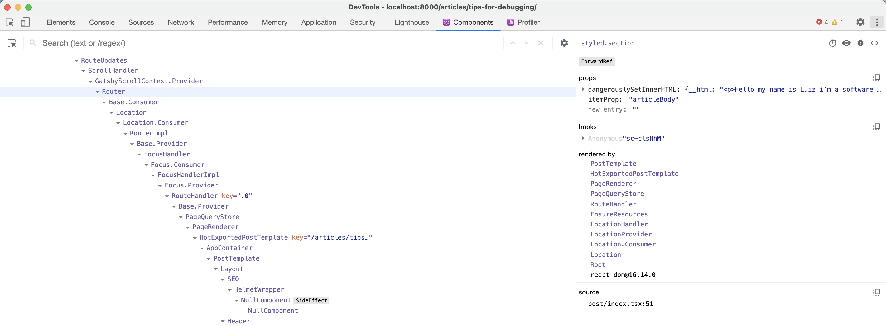
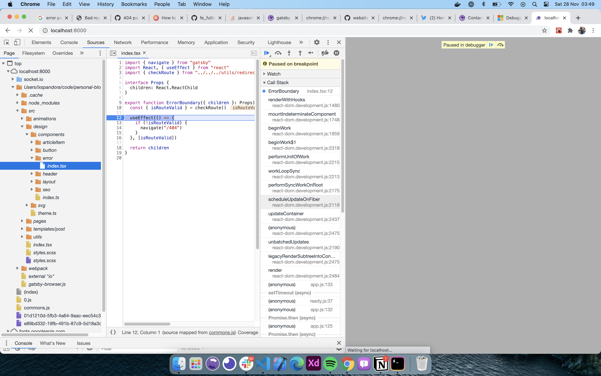
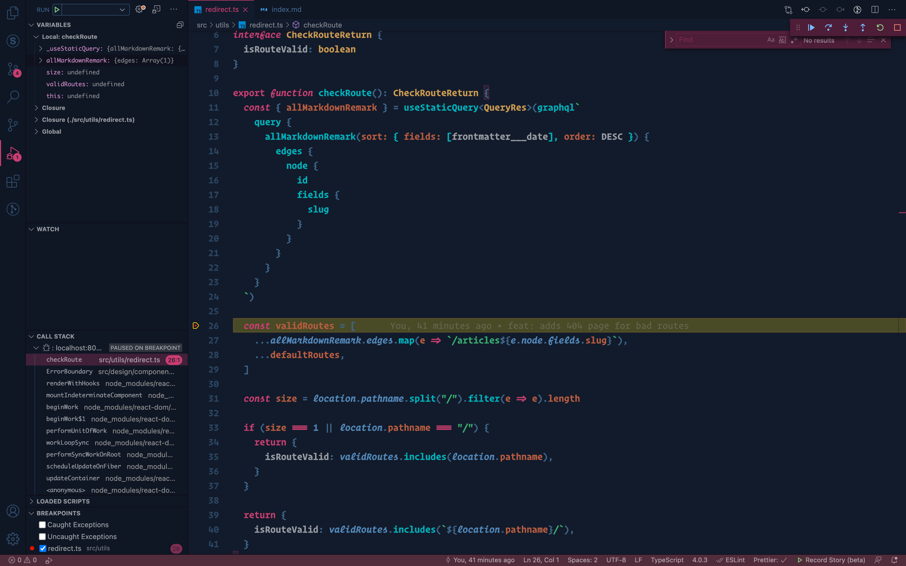

Hello my name is Luiz i'm a software engineer and in this article im going to show you how to improove
debugging on your react applications.
So without any further ado let's get started

# Debug

Do you know how expressjs and other nodejs libraries handle console.logs? They use debug for it

Do you know what debug is? debugjs is an npm library that will help you cleaning production logs and also
cleaning your console under development by using some filters.

Now im going to show you how debug works.

First you need to install the library, by running this command:

```sh
yarn add --dev debug
```

After this add this before your `yarn start` command `REACT_APP_DEBUG=*`, and create this config `debugConfig.js` file:

```jsx
import debug from "debug"

const { NODE_ENV, REACT_APP_DEBUG } = proccess.env

if (NODE_ENV === "development") {
  return debug.enable(REACT_APP_DEBUG)
} else {
  return debug.disable("*")
}
```

After create import the `debugConfig.js` to the root component:

(NOTE: I'll show in an example but apply the same proccess to your project)

```jsx
import React from 'react';
import debug from 'debug'
import 'debugConfig'

const log = debug('root:component');

const Root = () => {
  React.useEffect(() => {
    log('Welcome to the root application')
  }, [])
  return (
    <div>
      <h1>Hello World!</h1>
    </div>
  )
}

...
```

Now i'll show you a quick example of the filtering that i told you lets apply the same code but with two console.logs,
and we will change the env variable with `REACT_APP_DEBUG=root:component*`:

```jsx
import React from 'react';
import debug from 'debug'
import 'debugConfig'

const log = debug('root:component');
const secondLog = debug('not:show')

const Root = () => {
  React.useEffect(() => {
    log('Welcome to the root application')
    // this log will never show until we change the REACT_APP_DEBUG variable
    secondLog('This log will not show')
  }, [])
  return (
    <div>
      <h1>Hello World!</h1>
    </div>
  )
}

...
```

# React Dev Tools

Now let's talk about real react debugging, do you know what React DevTools is?

It's a extension that you can install to your google chrome and see some cool information of your react website whole three
like: Props, States and some Context things also. And also has a cool part of this extension that is the react profiler
that you can check the performance of your react apps!

In order to install it click on the link bellow

[React DevTools Chrome Webstore Installation](https://chrome.google.com/webstore/detail/react-developer-tools/fmkadmapgofadopljbjfkapdkoienihi?hl=en)

So now that you installed the chrome devtools you can open the chrome devtools and you will notice that a some new tabs
were added to it!! The Profiler and the Components:



# Breaking Points

Now let's talk about a thing that i use a lot to debug my react apps, i think its something that its more common on langs
like C, C# and Java; but we can use it with JS on the browser and inside the VSCode also!

NOTE: So to see the source code you need to have source map disabled on your React app under development!

### Using the Chrome DevTools

First open the Chrome developer tools and go to the sources tab under the localhost section, select the desired file,
place a breaking point (By clicking on the line number that you want!) and reload the page and reproduce the expected
behaviour and you will see that will stop on thatspecific point that you placed!



### Using the VSCode Extension

Go to the vscode market place and install the Debugger for Chrome extension. And create a folder called `.vscode` on the
root of your project and add a file called `launch.json` with the following content:

```json
{
  // Use IntelliSense to learn about possible attributes.
  // Hover to view descriptions of existing attributes.
  // For more information, visit: https://go.microsoft.com/fwlink/?linkid=830387
  "version": "0.2.0",
  "configurations": [
    {
      "type": "chrome",
      "request": "launch",
      "name": "",
      "url": "http://localhost:8000",
      "webRoot": "${workspaceFolder}"
    }
  ]
}
```

Now go to the debugging section inisde your vscode and press the `Run and Debug` button, it will open a separate chrome
connected to your vscode, now place the breaking point and reload the page, and boom your vscode will stop on the desired
line


